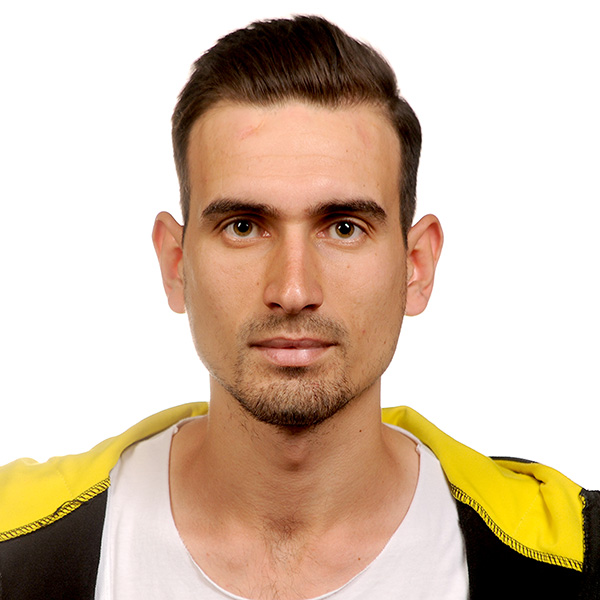

Denis Karemanaj
 
 
 

INFORMAZIONI PERSONALI
• Nato a Fieri il 11 marzo 2000
• Nazionalità: Albanese
• Stato civile: celibe

CAPACITÀ PERSONALI
• Programmazione
• Vendita

CONOSCENZA LINGUE STRANIERE
• Inglese (scritto e parlato) ottimo. 
• Italiano (scritto e parlato) buono.
• Spagnolo (scritto e parlato) buono.

ESPERIENZE DI LAVORO
• titolo: operatore
  • inizio: 2019
  • fine: 2020
  • datore di lavoro: Comdata
  
  
FORMAZIONE 
• Laurea in Ingegneria Matematica e Informatica
   • Data: 2018-corrente
   • Scuola: Università di Tirana
